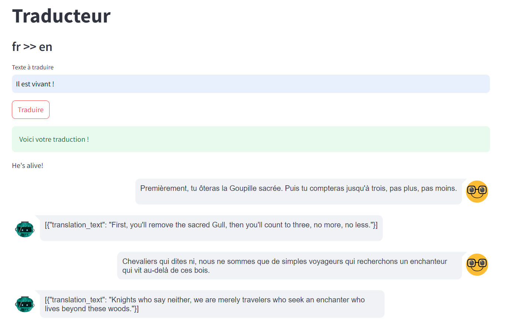

# Ticket d'incident 1

## Étapes pour reproduire le problème
1. Se connecter avec le compte **Cleese** / **Sacré Graal!**.
2. Le chat charge l'historique des prompts et des traductions de l'utilisateur.
3. Choisir l'option **"fr >> en"**.
4. Saisir un texte en français dans le champ **"Texte à traduire"**.
5. Valider avec le bouton **"Traduire"**.

## Résultat actuel
Après un instant d'attente, la phrase en anglais apparaît sous le message **"Voici votre traduction !"**.
Cependant, le chat n'affiche rien de nouveau.

## Comportement attendu
Le chat doit être à jour et faire apparaître le nouveau prompt avec sa traduction.
