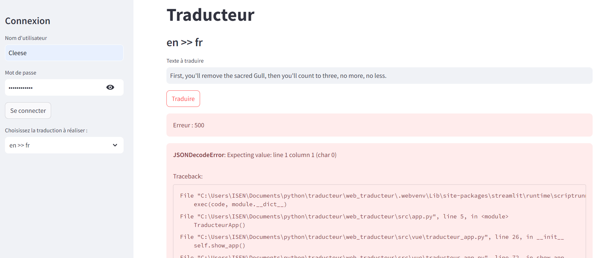

# Ticket d'incident 2

## Étapes pour reproduire le problème
1. Se connecter avec le compte **Cleese** / **Sacré Graal!**.
2. Le chat charge l'historique des prompts et des traductions de l'utilisateur.
3. Choisir l'option **"en >> fr"**.
4. Saisir un texte en anglais dans le champ **"Texte à traduire"**.
5. Valider avec le bouton **"Traduire"**.

## Résultat actuel
La traduction n'apparait pas, l'interface affiche une erreur 500.

## Comportement attendu
Après un instant d'attente, la phrase en français apparaît sous le message "Voici votre traduction !".
